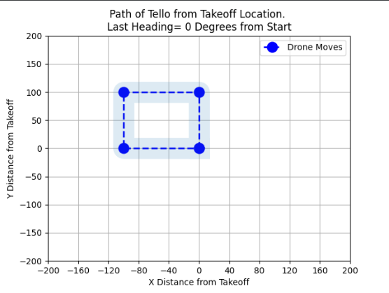

# :pencil: Week 2 exercises 
This week we will learn to use a simulation that simulates the DJI Tello drone, using this simulation we will simulate some simple movements with the drone. 
We will also connect to the real drone.

## :gear: Simulation setup
To use the simulation, you'll need to download an library.

You will accomplice this through the command lines within PyCharm.

1. Open the terminal within your PyCharm Application.

Next you will need to clone the git directory from the simulation.

2. Run the command  `git clone https://github.com/Fireline-Science/tello_sim`

Lastly you will to locate the file directory and install it.

3. Run the command `cd tello_sim`
4. Run the command `pip install .`

For more information go to [link](https://github.com/Fireline-Science/tello_sim)

## Exercise 2.1

In the first exercise we fly a simple square in our simulation. You are expected to get the following output as result.

